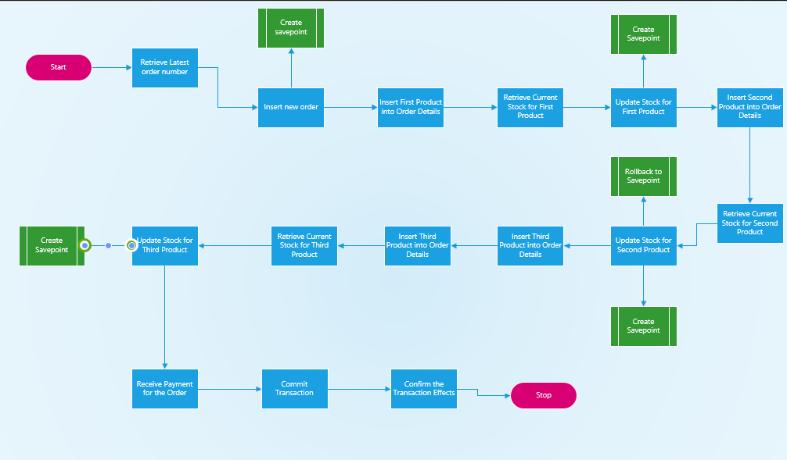

# BBT3104-Lab1of6-DatabaseTransactions

| **Key**                                                               | Value                                                                                                                                                                              |
|---------------|---------------------------------------------------------|
| **Group Name**                                                               | A4 |
| **Semester Duration**                                                 | 19th August - 25th November 2024                                                                                                                     

## Flowchart

## Pseudocode
START

-- Step 1: Begin Transaction
START TRANSACTION

-- Step 2: Retrieve the latest order number and increment it by 1
SET @orderNumber = (SELECT MAX(orderNumber) + 1 FROM orders)

-- Step 3: Insert a new order into the "orders" table
INSERT INTO orders(orderNumber, orderDate, requiredDate, shippedDate, status, customerNumber)
VALUES(@orderNumber, CURRENT_DATE, CURRENT_DATE + INTERVAL 3 DAY, CURRENT_DATE + INTERVAL 2 DAY, 'In Process', 145)

-- Step 4: Create a SAVEPOINT before the first product is inserted
SAVEPOINT before_product_1

-- Step 5: Insert first product into "orderdetails" table
INSERT INTO orderdetails(orderNumber, productCode, quantityOrdered, priceEach, orderLineNumber)
VALUES(@orderNumber, 'S18_1749', 2724, '136', 1)

-- Step 6: Retrieve current stock quantity for first product
SET @quantityInStock = (SELECT quantityInStock FROM products WHERE productCode = 'S18_1749')

-- Step 7: Update the stock for the first product
UPDATE products SET quantityInStock = @quantityInStock - 2724 WHERE productCode = 'S18_1749'

-- Step 8: Create a SAVEPOINT before the second product is inserted
SAVEPOINT before_product_2

-- Step 9: Insert second product into "orderdetails" table
INSERT INTO orderdetails(orderNumber, productCode, quantityOrdered, priceEach, orderLineNumber)
VALUES(@orderNumber, 'S18_2248', 540, '55.09', 2)

-- Step 10: Retrieve current stock quantity for second product
SET @quantityInStock = (SELECT quantityInStock FROM products WHERE productCode = 'S18_2248')

-- Step 11: Update the stock for the second product
UPDATE products SET quantityInStock = @quantityInStock - 540 WHERE productCode = 'S18_2248'

-- Step 12: Rollback transaction to the savepoint before the second product
ROLLBACK TO SAVEPOINT before_product_2

-- Step 13: Create a SAVEPOINT before the third product is inserted
SAVEPOINT before_product_3

-- Step 14: Insert third product into "orderdetails" table
INSERT INTO orderdetails(orderNumber, productCode, quantityOrdered, priceEach, orderLineNumber)
VALUES(@orderNumber, 'S12_1099', 68, '95.34', 3)

-- Step 15: Retrieve current stock quantity for third product
SET @quantityInStock = (SELECT quantityInStock FROM products WHERE productCode = 'S12_1099')

-- Step 16: Update the stock for the third product
UPDATE products SET quantityInStock = @quantityInStock - 68 WHERE productCode = 'S12_1099'

-- Step 17: Receive the payment for the order
INSERT INTO payments(customerNumber, checkNumber, paymentDate, amount)
VALUES (145, 'JM555210', CURRENT_DATE, 300000)

-- Step 18: Commit the transaction to save changes
COMMIT

-- Step 19: Confirm the effects of the committed transaction
SELECT * FROM orderdetails WHERE orderNumber = @orderNumber

END

## Support for the Sales Departments' Report
Create a Payment Schedule Table
New Table: payment_schedule
Create a separate table that tracks individual payments made for each order. This would allow the system to record multiple payments against a single order, along with the dates, amounts, and remaining balance.

CREATE TABLE payment_schedule (
    scheduleID INT PRIMARY KEY AUTO_INCREMENT,
    orderNumber INT,
    paymentDate DATE,
    amountPaid DECIMAL(10, 2),
    remainingBalance DECIMAL(10, 2),
    FOREIGN KEY (orderNumber) REFERENCES orders(orderNumber)
);
This table will store partial payments made for each order and the remaining balance after each payment. It provides a clear history of payments and the outstanding amount for each order.

2. Add a totalAmount Column to the Orders Table
Modify the orders Table
Add a totalAmount column to the orders table that stores the total amount due for each order. This will help in calculating the remaining balance by comparing it with payments made.
ALTER TABLE orders ADD COLUMN totalAmount DECIMAL(10, 2);
This field will make it easy to compute the total amount due for each order, especially when generating reports on payments.

3. Update the Payments Table to Track Instalments
Modify the payments Table
Ensure the payments table tracks partial payments by allowing multiple entries per order. You can update the schema to include the order number and the paid amount.
CREATE TABLE payments (
    paymentID INT PRIMARY KEY AUTO_INCREMENT,
    orderNumber INT,
    customerNumber INT,
    paymentDate DATE,
    amountPaid DECIMAL(10, 2),
    FOREIGN KEY (orderNumber) REFERENCES orders(orderNumber),
    FOREIGN KEY (customerNumber) REFERENCES customers(customerNumber)
);
This ensures that each payment, whether full or partial, is linked to a specific order and can be tracked.

4. Generate the Report
Create a query that joins the orders, payment_schedule, and payments tables to calculate and display orders that have not been fully paid along with the remaining balance.

SELECT o.orderNumber, o.totalAmount, 
       (o.totalAmount - SUM(p.amountPaid)) AS remainingBalance
FROM orders o
LEFT JOIN payments p ON o.orderNumber = p.orderNumber
GROUP BY o.orderNumber
HAVING remainingBalance > 0;
This query shows orders where the remaining balance is greater than zero, indicating that the order has not been fully paid.